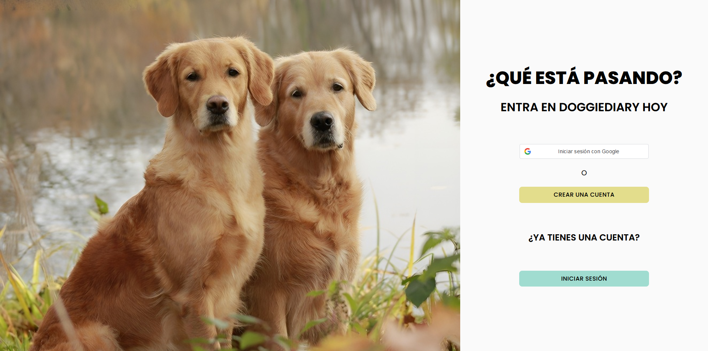
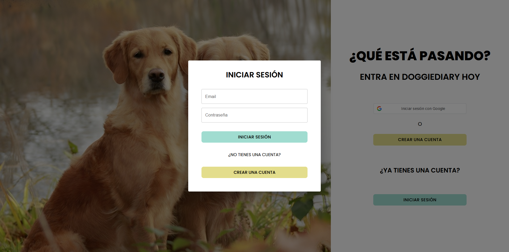
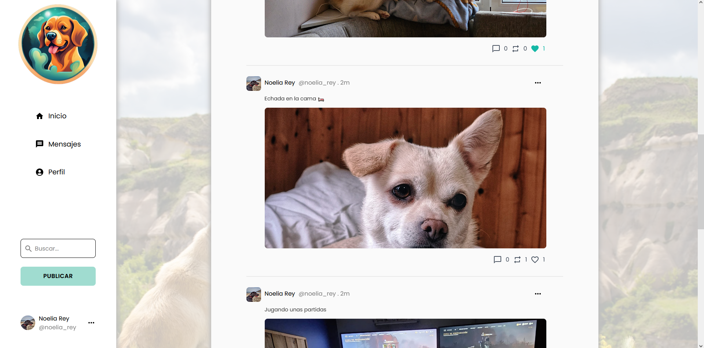

## Índice

- [DoggieDiary](#doggiediary)
- [Hecho con](#tecnologías-usadas)
- [Cómo lanzar el proyecto](#cómo-lanzar-el-proyecto)
- [Organización del proyecto](#organización-proyecto)
- [Características de la aplicación](#caracteristicas-aplicacion)

<a id="doggiediary"></a>
# 🐶 DoogieDiary

La red social canina para dueños y amantes de los perros. Conéctate con tus amigos peludos, comparte aventuras y crea recuerdos inolvidables en un solo lugar.



<a id="tecnologías-usadas"></a>
## 🏭 Tecnologías usadas

<a href="https://git-scm.com/" target="_blank" rel="noreferrer"></a><a href="https://www.oracle.com/java/" target="_blank" rel="noreferrer"></a><a href="https://developer.mozilla.org/en-US/docs/Web/JavaScript" target="_blank" rel="noreferrer"></a><a href="https://vitejs.dev/" target="_blank" rel="noreferrer"></a><a href="https://developer.mozilla.org/en-US/docs/Glossary/HTML5" target="_blank" rel="noreferrer"></a><a href="https://www.w3.org/TR/CSS/#css" target="_blank" rel="noreferrer"></a><a href="https://reactjs.org/" target="_blank" rel="noreferrer"></a><a href="https://www.postgresql.org/" target="_blank" rel="noreferrer"></a>

<a id="cómo-lanzar-el-proyecto"></a>
## 🚀️ Cómo lanzar el proyecto

- Frontend

```
cd frontend
npm install
npm run dev
```

- Backend

```
cd backend
mvn spring-boot:run
```

También necesitarás una base de datos en PostgreSQL llamada `doggiediary` para poder lanzar el backend (ver `src/main/resources/application.properties)`).

<a id="organización-proyecto"></a>
## 📄 Organización del proyecto

### - [Figma](https://www.figma.com/file/I8zVz3jfD6AzxwrUCJdRyE/DoggieDiary?type=design&node-id=0%3A1&mode=design&t=UWQtefTOnpwbo5HB-1)

### - [Trello](https://trello.com/invite/b/gU3LiPNv/ATTId75fb4379a10d81e45e623bcc09216bf06F42D9E/doggiediary)

<a id="caracteristicas-aplicacion"></a>
## 🐾 Características de la aplicación

Nuestra aplicación es una red social diseñada especialmente para dueños y amantes de perros. Regístrate y conecta con otros amantes de los peludos, comparte tus experiencias, consejos y momentos especiales con tu mascota. ¡Únete a nuestra comunidad canina y haz amigos peludos!


